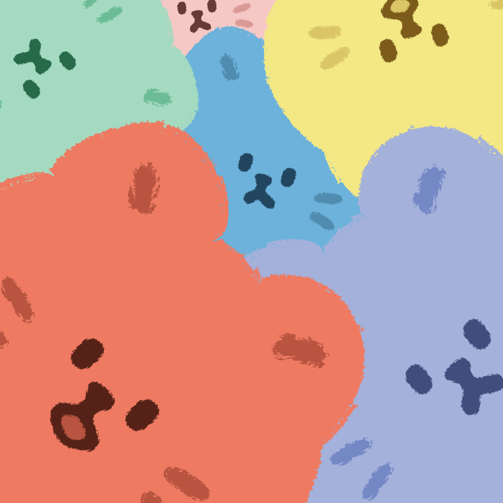
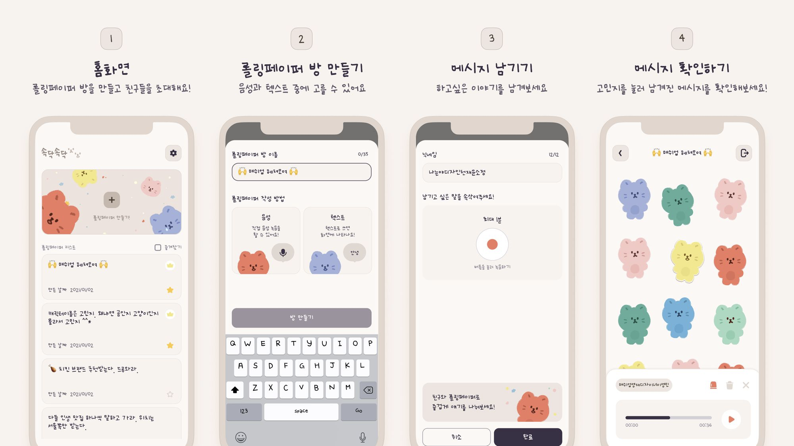

# 속닥속닥

<div>
  <kbd>
    
  </kbd>
</div>
롤링페이퍼 서비스


## 🗣프로젝트소개

```
<간단 설명>
롤링페이퍼를 음성으로 남기다.

<상세 설명>
나만의 롤링페이퍼 방을 만들고, 친구들을 초대해보세요!
링크만 있다면 누구든지 롤링페이퍼 방에 들어와 익명으로 메시지를 남길 수 있어요.
말하기 어려웠던 고민에서부터 시시콜콜한 안부까지, 하고싶었던 말을 남겨보세요.

<메인 기능>
1️⃣ 딥링크를 통해 롤링페이퍼 방에 초대하기
2️⃣ 음성 또는 텍스트로 익명 메시지 남기기
3️⃣ 나만의 방을 주제에 따라 여러개 만들고, 마음에 드는 방은 즐겨찾기
```


### 개발기간

2021.01.09 ~ 2021.04.23


### 사용법

<div>
  <kbd>
    
  </kbd>
</div>


## 🧑🏻‍💻팀원소개

<table>
  <tr><td rowspan="3" align="center" width="150">iOS</td>
    <td>김남수</td>
    <td>어쩌다 팀장된 사람</td>
  </tr>
  <tr>
    <td>이호찬</td>
    <td>롤 5인큐 구합니다</td>
  </tr>
  <tr>
    <td>김주희</td>
    <td>스물 열한살</td>
  </tr>
    <tr><td rowspan="2" align="center">디자인</td>
      <td>윤소정</td>
      <td>잘 부탁드려요~</td>
  </tr>
  <tr>
    <td>이영민</td>
    <td>잘 부탁드립니다</td>
  </tr>
    <tr><td rowspan="4" align="center">스프링</td>
      <td>김연정</td>
      <td>노는게 젤 좋아</td>
  </tr>
  <tr>
    <td>김원경</td>
    <td>9기</td>
  </tr>
  <tr>
    <td>김재현</td>
    <td>서비스에 관심많은 개발자</td>
  </tr>
  <tr>
    <td>김종윤</td>
    <td>화이..팅!</td>
  </tr>
    <tr><td rowspan="3" align="center">안드로이드</td>
      <td>박지영</td>
      <td>현생이 뽀로로 29살 파이팅</td>
  </tr>
  <tr>
    <td>정세희</td>
    <td>노는게 제일 좋아</td>
  </tr>
  <tr>
    <td>고승윤</td>
    <td>...</td>
  </tr>
</table>


## 🛠스펙

* iOS14+
* SwiftUI
* Combine
* AVFoundation
* Moya
* Firebase DynamicLinks


## 🎉자랑

* 🏆서비스 완성도 상 2회 수상
* 앱스토어배포 [링크](https://apps.apple.com/app/id1557251130)

